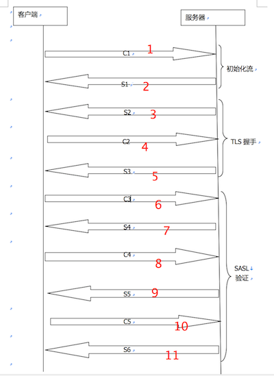

# socket从建立Socket到登录成功的报文

### 流程图

#### 1. 客户端初始化流给服务器

	<stream:stream to="127.0.0.1" xmlns="jabber:client"  xmlns:stream="http://etherx.jabber.org/streams" version="1.0">
	
#### 2. 服务器向客户端发送流标签作为应答

	<?xml version='1.0' encoding='UTF-8'?>
	<stream:stream xmlns:stream="http://etherx.jabber.org/streams" xmlns="jabber:client" from="192.168.1.115" id="3aeb273e" xml:lang="en" version="1.0">
	
#### 3. 服务器发送STARTTLS范围

	<stream:features>
        <starttls xmlns="urn:ietf:params:xml:ns:xmpp-tls"/>
        <mechanisms xmlns="urn:ietf:params:xml:ns:xmpp-sasl">
            <mechanism>DIGEST-MD5</mechanism>
            <mechanism>PLAIN</mechanism>
            <mechanism>ANONYMOUS</mechanism>
            <mechanism>CRAM-MD5</mechanism>
        </mechanisms>
        <compression xmlns="http://jabber.org/features/compress">
            <method>zlib</method>
        </compression>
        <auth xmlns="http://jabber.org/features/iq-auth"/>
        <register xmlns="http://jabber.org/features/iq-register"/>
    </stream:features>
    
#### 4. 客户端发送STARTTLS命令给服务器

	<starttls xmlns="urn:ietf:params:xml:ns:xmpp-tls"/>
	
#### 5. 服务器通知客户端可以继续进行

	<proceed xmlns="urn:ietf:params:xml:ns:xmpp-tls"/>
	
#### 6. TLS 握手成功, 客户端初始化一个新的流给服务器 (开始SASL握手)

	<stream:stream to="192.168.1.115" xmlns="jabber:client"
        xmlns:stream="http://etherx.jabber.org/streams" version="1.0">
        
#### 7. 服务器通知客户端可用的验证机制(到这一步为止, 表明加密的socket已经建立成功): 

	<?xml version='1.0' encoding='UTF-8'?>
	<stream:stream xmlns:stream="http://etherx.jabber.org/streams" xmlns="jabber:client"
    from="192.168.1.115" id="3aeb273e" xml:lang="en" version="1.0">
    <stream:features>
        <mechanisms xmlns="urn:ietf:params:xml:ns:xmpp-sasl">
            <mechanism>DIGEST-MD5</mechanism>
            <mechanism>PLAIN</mechanism>
            <mechanism>ANONYMOUS</mechanism>
            <mechanism>CRAM-MD5</mechanism>
        </mechanisms>
        <compression xmlns="http://jabber.org/features/compress">
            <method>zlib</method>
        </compression>
        <auth xmlns="http://jabber.org/features/iq-auth"/>
        <register xmlns="http://jabber.org/features/iq-register"/>
    </stream:features>	
    
#### 8. 客户端选择一个验证机制(XMPPFrameWork优先选择DIGEST-MD5,然后选择PLAIN模式进行验证)

	<auth mechanism="DIGEST-MD5" xmlns="urn:ietf:params:xml:ns:xmpp-sasl"/>
	
#### 9. 服务器发送一个 [BASE64] 编码的挑战给客户端

	<challenge xmlns="urn:ietf:params:xml:ns:xmpp-sasl">cmVhbG09IjE5Mi4xNjguMS4xMTUiLG5vbmNlPSJjVmYrclQzbVg4TklqUTVyemU5UUQ4K3BsMVhqUitaUjRRSlBqNkJpIixxb3A9ImF1dGgiLGNoYXJzZXQ9dXRmLTgsYWxnb3JpdGhtPW1kNS1zZXNz</challenge>
	
**解码后的挑战信息是:**

	realm="192.168.1.115",nonce="cVf+rT3mX8NIjQ5rze9QD8+pl1XjR+ZR4QJPj6Bi",qop="auth",charset=utf-8,algorithm=md5-sess
	
#### 10. 客户端发送一个[BASE64]编码的回应这个挑战:

	<response xmlns="urn:ietf:params:xml:ns:xmpp-sasl">Y2hhcnNldD11dGYtOCx1c2VybmFtZT0ibHpwMSIscmVhbG09IjE5Mi4xNjguMS4xMTUiLG5vbmNlPSJjVmYrclQzbVg4TklqUTVyemU5UUQ4K3BsMVhqUitaUjRRSlBqNkJpIixuYz0wMDAwMDAwMSxjbm9uY2U9IitSNzRpUjhzUkdxdE51VWdHY0JYYWZUbzI4N2VxWFVocVpGbno1RTAiLGRpZ2VzdC11cmk9InhtcHAvMTkyLjE2OC4xLjExNSIsbWF4YnVmPTY1NTM2LHJlc3BvbnNlPWYyNWY2NTVlMDQzOTkyMGU0YjJiNjQ3NDQ1Mzk5YzgxLHFvcD1hdXRoLGF1dGh6aWQ9Imx6cDEi</response>
	
**解码后的回应信息是:**

	charset=utf-8,username="lzp1",realm="192.168.1.115",nonce="cVf+rT3mX8NIjQ5rze9QD8+pl1XjR+ZR4QJPj6Bi",nc=00000001,cnonce="+R74iR8sRGqtNuUgGcBXafTo287eqXUhqZFnz5E0",digest-uri="xmpp/192.168.1.115",maxbuf=65536,response=f25f655e0439920e4b2b647445399c81,qop=auth,authzid="lzp1"
	
**发送的信息中, response为密码等数据信息**
	
#### 11. 服务器通知客户端验证成功

	<success xmlns="urn:ietf:params:xml:ns:xmpp-sasl">cnNwYXV0aD1iMzg0ODI2YTdjY2ZjNmJlNWFjNThiY2RlM2JlNGZlNQ==</success>
	
#### 12. 客户端重新初始化一个新流给服务器

	<stream:stream to="192.168.1.115" xmlns="jabber:client"
            xmlns:stream="http://etherx.jabber.org/streams" version="1.0">
            
**至此, SOCKET连接成功, 可以开始进行后续的操作了**
            
**说明：**

1、  DIGEST-MD5：如果帐号和密码都在Client对象中提供了，这种机制是首选，即使没有TLS加密也是安全的。

2、  PLAIN：如果DIGEST-MD5无效，就使用此种机制。在没有TLS加密时是不安全的。

3、  ANONYMOUS：此种机制在没有提供帐号和密码时使用。服务器将随机产生临时帐号和资源，提供限制的有效服务。

4、  EXTERNAL：此种机制目前只对客户端提供了证书和保密关键字（private key）而有效，服务器试图通过外部计算出客户端。举例来说，使用提供的证书或IP地址
